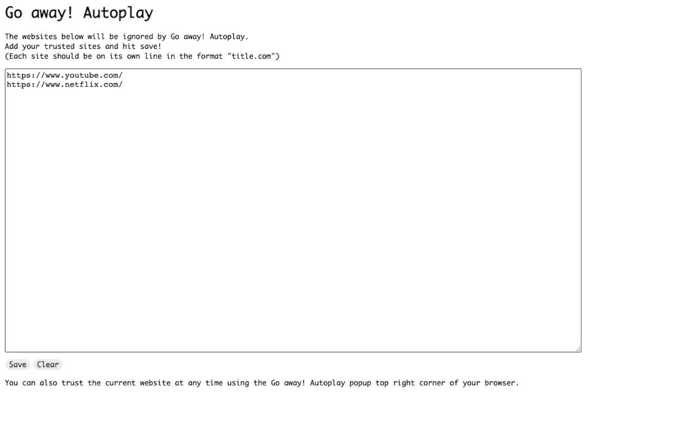
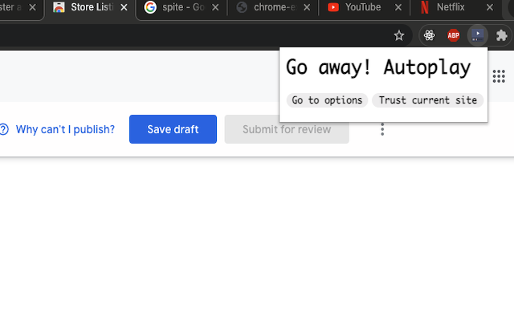
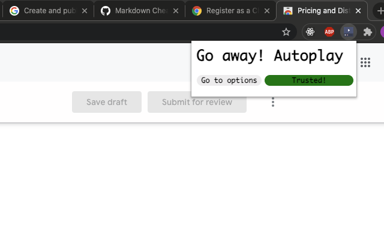

# Go Away! Autoplay
Try it yourself! https://chrome.google.com/webstore/detail/go-away-autoplay/cldkmmggmbkoailaihjhmphcnflknian?hl=en

A chrome extension which automatically mutes unruly sites employing autoplaying videos with sound.
Maintains a list of trusted websites defined by the user. Trusted websites will be ignored by Go away! Autoplay and can operate as normal. Trusted websites can be added/removed using the chrome extension popup or the options page as shown below:

